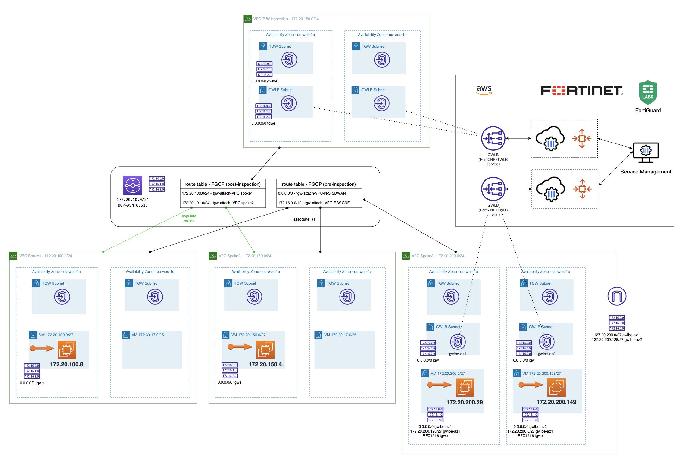

# IaC Terraform code to support Fortgate CNF webinar
## Introduction
This project gives an example of a scenario using diferent AWS services and [Fortigate CNF](https://fortigatecnf.com/admin-portal/authentication/login), that is Fortinet FWaaS in AWS, to control and inspect traffic. Firtsly, one VPC with an GWLB endpoints to forward traffic to Fortigate CNF instance for traffic Inbound-Outbound and inter-subnet. Secondly, a complete scenario with a VPC inspection to control traffic between VPCs attached to TGW. Thirdly, an example of a SDWAN scenario with Fortigate as Cloud On-ramp integrated in a SDWAN customer network.

## Diagram solution

Inbound-Outboung and VPC East-West traffic inspection with Fortigate CNF FWaaS


SDWAN full scenario


## Requirements
* [Terraform](https://learn.hashicorp.com/terraform/getting-started/install.html) >= 1.0.0
- Terraform Provider hashicorp/random v3.4.3
- Terraform Provider hashicorp/template v2.2.0
- Terraform Provider hashicorp/archive v2.2.0
- Terraform Provider hashicorp/http v3.2.1
- Terraform Provider hashicorp/aws v4.39.0
- Terraform Provider hashicorp/local v2.2.3
- Terraform Provider hashicorp/tls v4.0.4

## Deployment
* Clone the repository.
* Change ACCESS_KEY and SECRET_KEY values in terraform.tfvars.example.  And rename `terraform.tfvars.example` to `terraform.tfvars`.
* Change parameters in the variables.tf.
* If using SSO, uncomment the token variable in variables.tf and providers.tf
* Initialize the providers and modules:
  ```sh
  $ terraform init
  ```
* Submit the Terraform plan:
  ```sh
  $ terraform plan
  ```
* Verify output.
* Confirm and apply the plan:
  ```sh
  $ terraform apply
  ```
* If output is satisfactory, type `yes`.


## Destroy the instance
To destroy the instance, use the command:
```sh
$ terraform destroy
```

# Support
This a personal repository with goal of testing and demo Fortinet solutions on the Cloud. No support is provided and must be used by your own responsability. Cloud Providers will charge for this deployments, please take it in count before proceed.

## License
Based on Fortinet repositories with original [License](https://github.com/fortinet/fortigate-terraform-deploy/blob/master/LICENSE) © Fortinet Technologies. All rights reserved.

